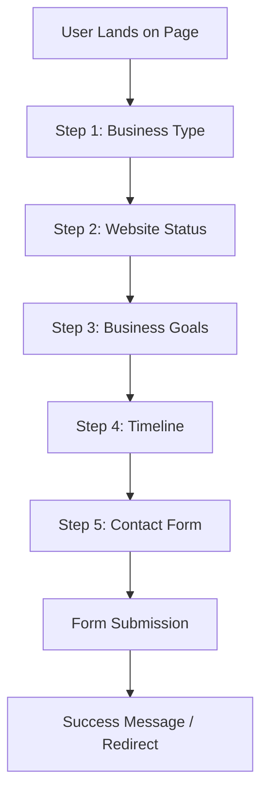

# Multi-Step Form Flow Diagram

## User Journey Flow



## Step-by-Step Breakdown

### Step 1: Business Type
```
┌─────────────────────────────────────────┐
│  Progress: ████░░░░░░░░░░░░░░░░ 20%    │
├─────────────────────────────────────────┤
│                                         │
│   What type of business do you run?     │
│                                         │
│   ┌───────────────────────────────┐    │
│   │ Trades (Plumber, Electrician) │    │
│   └───────────────────────────────┘    │
│   ┌───────────────────────────────┐    │
│   │ Local Service Business        │    │
│   └───────────────────────────────┘    │
│   ┌───────────────────────────────┐    │
│   │ E-commerce                    │    │
│   └───────────────────────────────┘    │
│   ┌───────────────────────────────┐    │
│   │ Professional Services         │    │
│   └───────────────────────────────┘    │
│   ┌───────────────────────────────┐    │
│   │ Other                         │    │
│   └───────────────────────────────┘    │
│                                         │
│   🔒 Your information is safe and will  │
│      never be shared with third parties │
└─────────────────────────────────────────┘
```

### Step 2: Website Status
```
┌─────────────────────────────────────────┐
│  Progress: ████████░░░░░░░░░░░░ 40%    │
├─────────────────────────────────────────┤
│                                         │
│   Which best describes your current     │
│   website?                              │
│                                         │
│   ┌───────────────────────────────┐    │
│   │ I don't have a website        │    │
│   └───────────────────────────────┘    │
│   ┌───────────────────────────────┐    │
│   │ I have one, but it doesn't    │    │
│   │ generate leads                │    │
│   └───────────────────────────────┘    │
│   ┌───────────────────────────────┐    │
│   │ I have one, but it looks      │    │
│   │ outdated                      │    │
│   └───────────────────────────────┘    │
│   ┌───────────────────────────────┐    │
│   │ I'm not sure                  │    │
│   └───────────────────────────────┘    │
│                                         │
│   🔒 Your information is safe and will  │
│      never be shared with third parties │
└─────────────────────────────────────────┘
```

### Step 3: Business Goals
```
┌─────────────────────────────────────────┐
│  Progress: ████████████░░░░░░░░ 60%    │
├─────────────────────────────────────────┤
│                                         │
│   What would more leads mean for your   │
│   business?                             │
│                                         │
│   ┌───────────────────────────────┐    │
│   │ More phone calls & leads      │    │
│   └───────────────────────────────┘    │
│   ┌───────────────────────────────┐    │
│   │ More bookings                 │    │
│   └───────────────────────────────┘    │
│   ┌───────────────────────────────┐    │
│   │ I just need a professional    │    │
│   │ online presence               │    │
│   └───────────────────────────────┘    │
│                                         │
│   🔒 Your information is safe and will  │
│      never be shared with third parties │
└─────────────────────────────────────────┘
```

### Step 4: Timeline
```
┌─────────────────────────────────────────┐
│  Progress: ████████████████░░░░ 80%    │
├─────────────────────────────────────────┤
│                                         │
│   How soon would you like to get        │
│   started?                              │
│                                         │
│   ┌───────────────────────────────┐    │
│   │ ASAP                          │    │
│   └───────────────────────────────┘    │
│   ┌───────────────────────────────┐    │
│   │ Within 30 days                │    │
│   └───────────────────────────────┘    │
│   ┌───────────────────────────────┐    │
│   │ Just researching              │    │
│   └───────────────────────────────┘    │
│                                         │
│   🔒 Your information is safe and will  │
│      never be shared with third parties │
└─────────────────────────────────────────┘
```

### Step 5: Contact Form
```
┌─────────────────────────────────────────┐
│  Progress: ████████████████████ 100%   │
├─────────────────────────────────────────┤
│                                         │
│   Almost there! Let's get in touch      │
│                                         │
│   ┌───────────────────────────────┐    │
│   │ Your Name *                   │    │
│   └───────────────────────────────┘    │
│   ┌───────────────────────────────┐    │
│   │ Your Email *                  │    │
│   └───────────────────────────────┘    │
│   ┌───────────────────────────────┐    │
│   │ Your Phone *                  │    │
│   └───────────────────────────────┘    │
│                                         │
│   ┌───────────────────────────────┐    │
│   │      Get Your Free Quote      │    │
│   └───────────────────────────────┘    │
│                                         │
│   🔒 Your information is safe and will  │
│      never be shared with third parties │
└─────────────────────────────────────────┘
```

## Component Structure

```
Hero Section
│
├── Hero Background (unchanged)
│   └── Background Image + Overlay
│
├── Multi-Step Form Container
│   │
│   └── Form Card (white, centered)
│       │
│       ├── Progress Bar
│       │   ├── Container (gray background)
│       │   └── Fill (green, animated width)
│       │
│       ├── Step 1 (visible initially)
│       │   ├── Question Title
│       │   └── Options Container
│       │       ├── Option Button 1
│       │       ├── Option Button 2
│       │       ├── Option Button 3
│       │       ├── Option Button 4
│       │       └── Option Button 5
│       │
│       ├── Step 2 (hidden)
│       ├── Step 3 (hidden)
│       ├── Step 4 (hidden)
│       │
│       ├── Step 5 - Contact Form (hidden)
│       │   ├── Title
│       │   ├── Name Input
│       │   ├── Email Input
│       │   ├── Phone Input
│       │   └── Submit Button
│       │
│       └── Privacy Message
│           ├── Lock Icon
│           └── Text
│
└── Hero Wave (unchanged)
```

## State Management

### Form Data Object
```javascript
{
  step1: {
    question: "What type of business do you run?",
    answer: "Trades (Plumber, Electrician, Builder, etc.)"
  },
  step2: {
    question: "Which best describes your current website?",
    answer: "I don't have a website"
  },
  step3: {
    question: "What would more leads mean for your business?",
    answer: "More phone calls & leads"
  },
  step4: {
    question: "How soon would you like to get started?",
    answer: "ASAP"
  },
  contact: {
    name: "John Smith",
    email: "john@example.com",
    phone: "07123456789"
  },
  timestamp: "2026-01-25T00:32:00Z"
}
```

## Interaction Flow

1. **Page Load**
   - Show Step 1
   - Progress bar at 20%
   - All other steps hidden

2. **User Clicks Option**
   - Highlight selected option
   - Store answer in formData
   - Wait 500ms
   - Fade out current step
   - Update progress bar
   - Fade in next step

3. **Steps 1-4 Complete**
   - Progress bar reaches 100%
   - Show contact form (Step 5)
   - Focus on name input

4. **User Fills Contact Form**
   - Validate each field on blur
   - Show error messages if invalid
   - Enable submit button when all valid

5. **User Clicks Submit**
   - Show loading state
   - Validate all fields
   - Submit data (API call or console.log)
   - Show success message
   - Optional: Redirect or reset form

## Animation Timing

- Step transition: 400ms fade
- Progress bar: 500ms ease-in-out
- Option hover: 300ms ease
- Option click: 150ms scale
- Auto-advance delay: 500ms

## Responsive Breakpoints

- **Desktop**: > 1024px - Full size form
- **Tablet**: 768px - 1024px - Slightly smaller
- **Mobile**: < 768px - Compact layout
- **Small Mobile**: < 480px - Minimal padding
